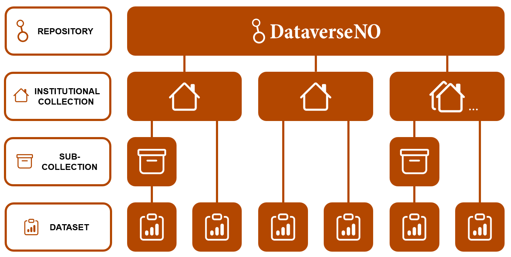

# What is DataverseNO?

[REUSE: links/dataverseno-repository | DataverseNO] is a national repository for open research data. It enables researchers to archive, publish, preserve, and share datasets for free and in a way that makes them easier to find, access, understand, and reuse.

DataverseNO hosts research data from all disciplines, but currently only accepts datasets that can be shared openly. This means that [REUSE: terms/data-requiring-protection] must be appropriately managed before it can be deposited. If you are unsure whether your data can be shared through DataverseNO, please contact your [REUSE: links/contact-page | local user support].

A distinctive feature of DataverseNO is that all datasets are [PAGE: why-use-dataverseno#curation-and-preservation | curated] by trained support staff (curators) before publication. Curators provide dataset-specific guidance on metadata, documentation, file formats, licensing, and other aspects that contribute to making data more Findable, Accessible, Interoperable, and Reusable ([REUSE: terms/fair]).

DataverseNO is operated by UiT The Arctic University of Norway on behalf of a national consortium of [PAGE: who-can-use-dataverseno#researchers-from-partner-institutions | partner institutions]. The repository is organised into institutional collections, allowing participating institutions to manage and showcase their research outputs while following common repository policies and standards. Institutional collections may also contain sub-collections for research centres, projects, or other organisational units (Figure 1).

_Figure 1. DataverseNO repository structure. Datasets are generally published in institutional collections._

DataverseNO is operated according to a common agreement (the [REUSE: links/dataverseno-organizational-agreement]) between the partner institutions, ensuring trustworthy governance and consistent repository practices. The repository is based on the open-source platform Dataverse, a widely used research data repository solution developed by an international community led by Harvard University.
